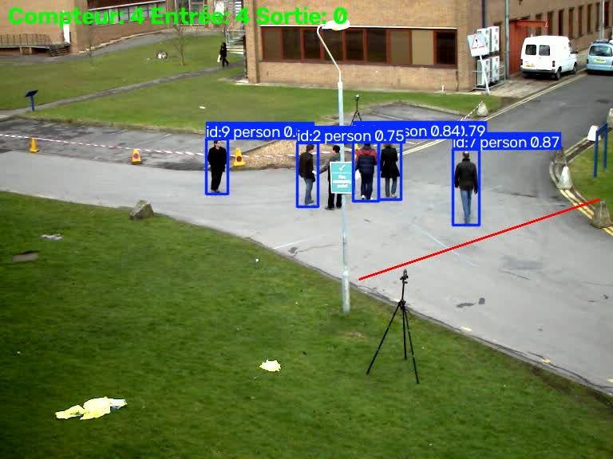

# 🚗 Détection et Tracking d'Objets avec YOLO

Petit projet de Computer Vision : détecter des personnes dans une vidéo, les suivre d'une frame à l'autre, et compter celles qui franchissent une ligne — avec YOLOv8 et OpenCV.

## Technologies utilisées

- **Python 3**
- **OpenCV** (`opencv-python`) — lecture/écriture vidéo frame par frame, dessin des annotations (boîtes, ligne, compteur)
- **Ultralytics YOLOv8** (`yolov8n`, pré-entraîné sur COCO, 80 classes) — détection d'objets (filtrée sur la classe "personne") et tracking multi-objets intégré (ByteTrack)
- **Git / GitHub**

## Pipeline

```
Vidéo (vtest.avi)
        │
        ▼
Lecture frame par frame (OpenCV)
        │
        ▼
Détection d'objets, classe "personne" uniquement (YOLOv8n, classes=[0])
        │
        ▼
Tracking multi-objets (ByteTrack, via model.track())
        │
        ▼
ID stable par personne + ligne de comptage orientable (2 points A/B)
        │
        ▼
Détection du côté (produit vectoriel) + compteur entrées/sorties
        │
        ▼
Vidéo annotée en sortie (boîtes, IDs, ligne, compteur)
```

Le projet a été construit étape par étape, chaque script ajoutant une brique au pipeline :

| Script | Rôle |
|---|---|
| `explore_video.py` | Lecture d'une vidéo, métadonnées (FPS, dimensions, frames) |
| `yolo_test.py` | Première détection YOLO sur une image, inspection du résultat brut |
| `detect_video.py` | Détection YOLO sur la vidéo complète |
| `track_video.py` | Ajout du tracking (ID stable par personne) |
| `count_line.py` | Ligne de comptage, puis enrichi (voir ci-dessous) |

## Améliorations post-MVP

Corrections apportées dans `count_line.py` après la première version fonctionnelle :

- **Filtrage sur la classe "personne"** (`classes=[0]`) : le tracking ne suit plus que les personnes, ce qui réduit les faux positifs sur des objets fixes du décor.
- **Comptage directionnel** : deux compteurs séparés (entrées / sorties) au lieu d'un total unique.
- **Ligne de comptage orientable** : remplacement de la hauteur fixe (`LINE_Y`) par une ligne définie par deux points (`LINE_A`, `LINE_B`), avec détection du côté via un produit vectoriel — suit l'angle réel d'un chemin plutôt qu'une ligne horizontale imposée.

## Comment lancer le projet

```bash
git clone <url-du-repo>
cd object-tracking-yolo
python3 -m venv venv
source venv/bin/activate
pip install -r requirements.txt
python3 count_line.py
```

La vidéo annotée est générée dans `data/output_line.mp4`.

## Exemple de résultat



## Limites

- **Modèle nano** (le plus léger/rapide de YOLOv8) : reste le modèle le moins précis de la famille YOLOv8, même avec le filtrage par classe.
- **ID switch** : quand deux personnes se croisent ou que l'une est temporairement cachée, le tracker peut lui attribuer un nouvel ID à sa réapparition — limite connue des trackers basés sur la position plutôt que sur l'apparence.
- **Calibration manuelle de la ligne** : les coordonnées de `LINE_A`/`LINE_B` sont choisies à l'œil pour cette vidéo précise ; changer de caméra ou d'angle nécessite de les redéfinir à la main.
- Traitement de la vidéo en différé (pas en temps réel) — une version webcam/flux live a été explorée mais pas encore aboutie.

## Remerciements

Vidéo de test `vtest.avi` fournie par le dépôt officiel OpenCV (samples).
